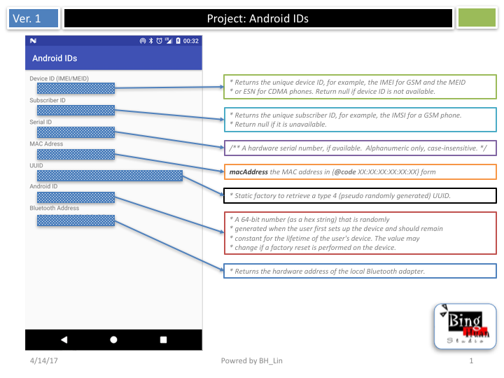

# Android_IDs

 

 

<h2>Download</h2> 

 
<a target="_blank" href="https://android-developers.googleblog.com/2011/03/identifying-app-installations.html">https://android-developers.googleblog.com/2011/03/identifying-app-installations.html</a>